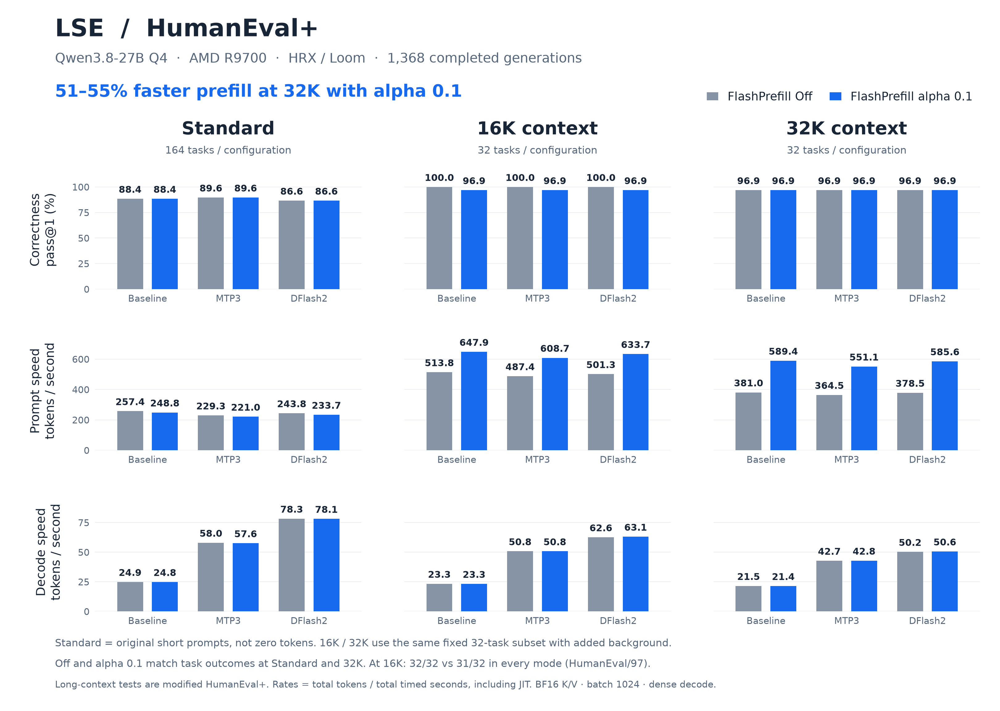
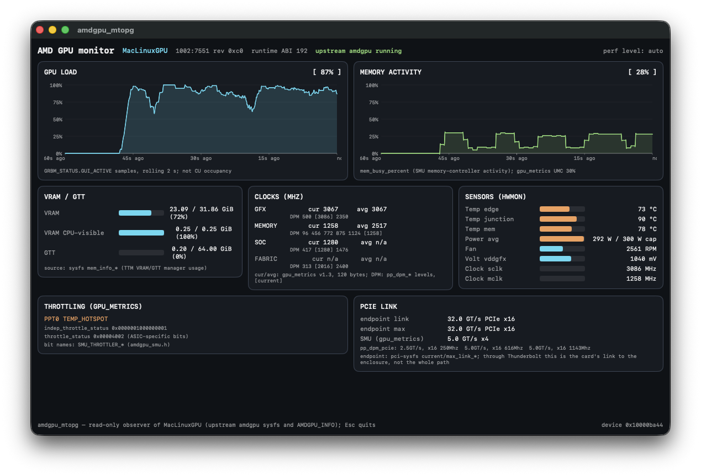

# Lemon Seed Engine (LSE)

LSE is an LLM inference engine with a built-in kernel compiler and optimization engine.
It specializes GPU kernels for the model and device, compiles them through Loom,
and caches the compiled kernels for reuse. LSE runs text models on AMD GPUs through
an HTTP server, a command-line program, or inside your own app through libLSE, its C API.

**LemonSeed Engine** · [mac_linuxgpu](https://github.com/lemonade-sdk/mac_linuxgpu) · [amdgpu_mtopg](https://github.com/lemonade-sdk/amdgpu_mtopg)

- **HTTP server:** Chat Completions, text completions, reasoning output, and function tool calls.
- **Model formats:** MLX group-affine Q4, Q6, and Q8 weights; BF16, FP16, and FP32 weights.
- **Speculative decoding:** Native multi-token prediction (MTP) or an optional DFlash2 draft model.
  A BF16 DFlash2 checkpoint is converted to Q8 automatically on first use.
- **In-process library:** libLSE, a plain C API (`include/lse/lse.h`) on every platform,
  including an XCFramework for iOS and iPadOS.
- **Model info and memory estimates:** inspect a checkpoint and size a context before loading it.
- **GPU execution:** HRX with Loom kernel source, the default on every platform. On Linux the
  legacy HIP dialect remains selectable with `--dialect hip`.
- **CPU backend:** Reference execution and a fallback when available GPU backends cannot start.
  CPU fallback is always reported; `--no-cpu-fallback` turns it into an error.

[Install](#install-a-release) · [Start the server](#start-the-http-server) ·
[MTP and DFlash2](#select-a-decoding-mode) · [Client setup](#connect-a-client) ·
[Memory estimates](#model-info-and-memory-estimates) · [libLSE](#use-lse-as-a-library) ·
[iPadOS](#ios-and-ipados) · [Performance](#performance-on-macos-r9700) · [Benchmarks](#humaneval-through-32k) ·
[Build](#build-from-source) · [Troubleshooting](#troubleshooting)

## Performance on macOS (R9700)

**Code generation: 157.7 tok/s with DFlash2** on a Radeon AI PRO R9700. The prompt is HumanEval-style, 640 tokens are generated at temperature 0.6, and the draft acceptance is 98.4%.

Setup:
- Model: Qwen3.8-27B Q4 (MLX group-affine) with the Q8 DFlash2 draft (`--dflash2=on --dflash2-model qwen38-27b-dflash2-q8`).
- GPU: R9700 over Thunderbolt 5 on an Apple M5 Max, mac_linuxgpu v0.1.162 (build 266), LSE 0.5.7, measured 2026-10-07.
- Server flags: `--pool hrx:0 --batch-size 1024 --ubatch-size 1024 --kv-cache-dtype bf16 --kv-len 262100 --temperature 0.6`, with `LSE_REQUIRE_DEVICE_KERNELS=1` (no CPU fallback).
- Adaptive verify width is on (the default).
- Each mode runs in one server session. Timing starts after about 1.5 s of sustained decode, because the GPU lowers its clocks after light work.

Decode at temperature 0.6, with draft acceptance in parentheses:

| Prompt | DFlash2 | MTP=3 | Plain |
| --- | ---: | ---: | ---: |
| **Code**: HumanEval-style, six functions to implement (302 prompt tokens, 640 out) | **157.7 tok/s** (98.4%) | 115.6 tok/s (97.2%) | 32.0 tok/s |
| 2K prompt (2,406 tokens, 256 out) | 70.4 tok/s (74.6%) | 54.4 tok/s (69.8%) | 31.6 tok/s |
| 4K prompt (4,786 tokens, 256 out) | 66.5 tok/s (75.1%) | 55.6 tok/s (73.6%) | 31.1 tok/s |
| Essay (32 prompt tokens, 640 out) | 66.4 tok/s (70.2%) | 61.3 tok/s (70.1%) | 32.3 tok/s |

Notes on the decode table:
- DFlash2 (every prompt) and MTP=3 on code are medians of five runs. The other cells are medians of three.
- MTP=3 runs with `--mtp qwen38-27b-mtp-q8 --mtp-depth 3`. Plain runs with `--dflash2=off`.
- Mean verify width per pass (maximum 8): DFlash2 7.9 on code, 5.6 to 5.7 on the others; MTP=3 6.9 on code, 4.8 to 5.0 on the others.

Time to first token over the HTTP API, DFlash2 server, 128 tokens out:
- Cold is the first request of that size after the server starts, with the kernel cache on disk.
- Warm is the median of three requests after a warm-up.

| Prompt tokens | Warm TTFT | Warm prefill | Cold TTFT |
| ---: | ---: | ---: | ---: |
| 137 | 0.122 s | 1,127 tok/s | 0.182 s |
| 271 | 0.201 s | 1,345 tok/s | 0.199 s |
| 532 | 0.373 s | 1,425 tok/s | 0.375 s |
| 646 | 0.436 s | 1,483 tok/s | 0.434 s |
| 1,060 | 0.663 s | 1,599 tok/s | 0.672 s |
| 2,118 | 1.292 s | 1,640 tok/s | 1.289 s |
| 4,230 | 2.589 s | 1,634 tok/s | 2.596 s |
| 33,799 | 23.91 s | 1,414 tok/s | 24.09 s |

Model load, launch to ready, with the checkpoint in the file cache and the kernel cache on disk:
- 4.9 s with DFlash2, 3.4 s with MTP, 3.8 s plain.
- The server prepares every request shape's kernels before it reports ready.
- Host memory footprint at ready with DFlash2: 422 MB.
- The first launch of a new LSE build, with an empty kernel cache, compiles those kernels first: 110.8 s with DFlash2 on this machine.

### RDNA3.5 (gfx1151)

MS-S1 MAX with a Radeon 8060S (gfx1151), ROCm 7.13. Same model, flags and prompts, adaptive verify width on, temperature 0.6. Medians of three runs after a warm-up, with draft acceptance in parentheses:

| Prompt | DFlash2 | MTP=3 | Plain |
| --- | ---: | ---: | ---: |
| **Code** (HumanEval-style, 640 out) | **55.5 tok/s** (99.1%) | 34.9 tok/s (96.9%) | 13.6 tok/s |
| 2K prompt (256 out) | 23.2 tok/s (75.2%) | 20.8 tok/s (70.1%) | 13.5 tok/s |
| 4K prompt (256 out) | 24.3 tok/s (77.9%) | 23.6 tok/s (83.3%) | 13.3 tok/s |
| Essay (640 out) | 25.3 tok/s (72.0%) | 20.5 tok/s (65.4%) | 13.7 tok/s |

Prefill with the DFlash2 server, FlashPrefill V2 on (the gfx1151 default):

| Prompt | TTFT | Prefill |
| ---: | ---: | ---: |
| 256 | 0.636 s | 403 tok/s |
| 512 | 1.205 s | 425 tok/s |
| 1K | 2.020 s | 507 tok/s |
| 2K | 4.111 s | 498 tok/s |
| 4K | 8.364 s | 490 tok/s |
| 32K | 47.73 s | 687 tok/s |

Load with the kernel cache on disk: 4.6 s plain, 6.1 s with MTP. The first launch with an empty kernel cache takes 110.9 s.

### Linux (R9700)

The packaged v0.5.7 Linux archive on a Radeon AI PRO R9700 runs with ROCm 7.13, the same model and flags, and the default dialect (Loom). Decode at temperature 0.6, median of eight runs:
- **Code: 126.5 tok/s with DFlash2** (98.4% acceptance), 95.2 tok/s with MTP=3, 26.3 tok/s plain.
- Essay: 46.9 tok/s with DFlash2, 45.4 with MTP=3, 26.8 plain.

That host is a shared server under CPU load, and individual runs varied widely. Loading with DFlash2 and the kernel cache on disk takes 19.9 s.

**Optional kernel patch for RDNA4.**
- Linux users with GFX12 (RDNA4) cards, such as the R9700 or RX 9070, can apply ["drm/amdkfd: Put GFX12 compute queue MQDs in VRAM"](https://github.com/lemonade-sdk/mac_linuxgpu/blob/main/patches/linux/kfd-v12-mqd-vram.patch) to the amdgpu driver.
- What it changes:
  - KFD compute-queue descriptors (MQDs) are allocated in CPU-visible VRAM instead of system memory.
  - HDP is flushed at the end of `update_mqd`.
  - Upstream already does both for GFX 9.4.3.
- What was measured: the stall on a dispatch that exactly fills a shader engine (for example 253 to 256 workgroups of 256 threads).
  - On the Mac driver, which runs the same amdgpu code, it dropped from 51 µs to 17 µs.
  - Stock Linux measured 26 µs on the same dispatch.
- It has not been measured on a patched Linux kernel.
- It applies to GFX12 only. Graphics and Vulkan are unaffected.

### Output quality

Wikitext-2 perplexity with llama.cpp's method: 512-token chunks, 580 chunks, the same 297,193 token ids on both sides.
- LSE scores **7.1467 ± 0.0464** with the MLX 4-bit checkpoint. The value is identical on the R9700 under macOS and Linux, and on gfx1151.
- llama.cpp b11379 (Vulkan) scores 7.0759 ± 0.0461 with the GGUF Q4_0 file `unsloth/Qwen3.8-27B-Q4_0.gguf`.
- The quantization formats differ.
- See [Perplexity](docs/PERPLEXITY.md).

## HumanEval+ through 32K

**51–55% faster prefill at 32K** with FlashPrefill alpha 0.1 across Baseline,
MTP3 and DFlash2. The completed comparison covers **1,368 generations**;
correctness matches Off at Standard and 32K, with one additional failure per mode at 16K.
These results were measured with LSE 0.4.24; see [Performance on macOS](#performance-on-macos-r9700)
for the current release.

[](docs/benchmarks/flashprefill-humaneval-32k.png)

[research](docs/benchmarks/FlashPrefill-Results-Redesigned.pdf) · [Benchmark data](docs/benchmarks/flashprefill-humaneval-32k.json)

## FlashPrefill V2

The HTTP server enables FlashPrefill V2 prefill by default on supported R9700
HRX/LOOM configurations, with alpha 0.1 and batch/ubatch 1024.
Use **`--FlashPrefillV2=off`** for dense prefill. MTP and DFlash2 prompt prefill also use it;
their draft and verification passes stay dense.
Unsupported configurations use dense attention automatically.

These FlashPrefill figures were measured with LSE 0.4.23, before the 0.5.4 prefill
work; they compare sparse and dense prefill on that build. At 16K, the merged build
reached **632.1 prompt tok/s** versus 492.9 dense.
At 32K, the earlier matched pair reached **604.9 prompt tok/s** versus 378.1 dense. The 64-token greedy output matched. [Configuration and measurements](docs/experimental/sparse-attention.md).
Wikitext-2 perplexity with master `92cbdca`
([qualification](docs/R9700_QUALIFICATION.md#output-quality-perplexity-2026-10-07)):

- At ctx 512, dense and V2 both measure 7.1467.
- In 1024-token windows, dense measures 7.6503 and V2 7.6512.
- In 2048-token windows, dense measures 7.0368 and V2 7.0487.

Credit to [shcherbakov22](https://github.com/shcherbakov22/) for providing research on FlashPrefill v2  
[FlashPrefill v2 paper](https://arxiv.org/html/2608.19758v1)

## Kernel cache

The CLI and HTTP server create `~/.lse/cache/` automatically and reuse compiled
kernels across launches. Use `--cache-dir /path/to/cache` to select another
location. The startup log prints the selected directory. The flag takes precedence
over the legacy `LSE_CACHE_DIR` environment override. No environment setting is
required. Cache entries include the engine release version and check compiler
identity, device properties and kernel source. Startup removes complete older
LSE-owned artifact families from the selected directory. It preserves current
and newer releases, unrelated files, incomplete records and symlinks. An update
can compile kernels again; later launches reuse the current release cache.

Beside the compiled objects, each build keeps a launch index in
`launch-<release>-<build>/`. For every set of kernels the server prepares before
it reports ready, the index holds each kernel's launch description and the object
that contains them, keyed by what is known before any source is written: the
kernels' structural identities, the device, the compiler and a digest of the
engine's own source tree. A warm start makes those kernels resident from the
index without generating their source. Any change to the engine's source is a new
digest, so a rebuilt engine prepares from source once and indexes again; startup
keeps the indexes of the three most recently used other builds of the release and
removes older releases' indexes. An index entry or object that fails its checksum
is reported on stderr, discarded and rebuilt from source; it is never used.

## KV storage

K/V storage defaults to BF16 when the model declares BF16, including the local
Qwen3.8 checkpoints, and FP16 otherwise. LSE reads `dtype` or `torch_dtype` from
`text_config` before checking the top level. An explicit model `kv_cache_dtype`
setting overrides this default; `--kv-cache-dtype` overrides both. Supported
values are `fp32`, `fp16`, `bf16`, `fp8` and `bf8`. The setting applies to target
and MTP paged caches; DFlash2 retains its private FP32 ring. Attention accumulation
remains FP32.

FP16 and BF16 each halve paged KV storage relative to FP32. Eligible gfx1201
paged batches use WMMA directly from all five formats: FP16 storage uses FP16
Q/K/P/V matrix operands; FP32, BF16, FP8 and BF8 storage use BF16 operands after
decoding or conversion. Matrix accumulators, softmax state and output remain
FP32. Single-token and selected short-query split attention keep FP32 calculation.

KV bytes per token for Qwen3.8-27B (16 KV layers, four KV heads of 256), both K and V:

| `--kv-cache-dtype` | Bytes per token | 32K tokens |
| --- | ---: | ---: |
| `fp32` | 131,072 | 4 GiB |
| `fp16`, `bf16` | 65,536 | 2 GiB |
| `fp8`, `bf8` (with scales) | 33,280 | 1.02 GiB |

`--model-info` lists these figures for any checkpoint, and `--estimate` adds
the weights, recurrent state, draft and workspace for a whole configuration.
See [Model info and memory estimates](#model-info-and-memory-estimates).

See [KV cache formats](docs/KV_CACHE.md) and [K/V storage](docs/KV-STORAGE.md)
for format selection, memory management, and validation details.
Completed prefill workspaces are released while live K/V and compiled kernels
remain available for reuse.

## Supported platforms

| Platform | GPU requirements | Kernel source |
|---|---|---|
| Linux x86_64 | ROCm 7.x and [HRX](https://github.com/ROCm/hrx-system) | Loom (legacy HIP with `--dialect hip`) |
| macOS on Apple Silicon | An external AMD GPU and the installed [mac_linuxgpu driver](https://github.com/lemonade-sdk/mac_linuxgpu) | Loom |
| iPadOS on an M-series iPad | An external AMD GPU over Thunderbolt and an app that embeds the mac_linuxgpu driver and links `LSE.xcframework` | Loom, in process |
| CPU | A build with the CPU backend | CPU reference execution |

The tested macOS GPU is the R9700 (`gfx1201`). The macOS package includes HRX, Loom, and their runtime libraries.
It uses the HSA runtime installed by the GPU driver and does not install the DriverKit extension.

The macOS binaries target macOS 15 or later. GPU use also requires a macOS version supported by mac_linuxgpu.
See the driver instructions for that requirement.
[mac_linuxgpu](https://github.com/lemonade-sdk/mac_linuxgpu) replaces the earlier MacAMDGPU driver.



amdgpu_mtopg monitoring an AMD Radeon AI PRO R9700 over Thunderbolt 5 on an Apple M5 Max while LSE runs Qwen3.8-27B through mac_linuxgpu.

Linux release targets include `gfx942`, `gfx1150`, `gfx1151`, `gfx1200`, and `gfx1201`.
The Linux archive bundles its selected HRX runtime and patched Loom compiler;
root and `bin/` launchers load those libraries and forward the existing CLI arguments.
A compatible Linux C/C++ runtime, ROCm 7.x, HSA and GPU driver remain required.
The v0.5.7 binaries need glibc 2.43 or later and the GCC 16 libstdc++ (`GLIBCXX_3.4.35`,
`CXXABI_1.3.15`), with ROCm 7.x `libamd_comgr.so.3` and `libhsa-runtime64.so.1`: an
Ubuntu 26.04-class system.
`BUILD.json` records the compiler source pins, patch hashes and bundled library hashes.
Check each release for its build targets and runtime requirements.

## Install a release

Use the archive for your operating system from [Releases](https://github.com/Geramy/LSE/releases).
The examples below use `v0.5.7`.

Each install procedure sets `LSE_BIN` for the later commands. Use the same terminal for those commands.

### Linux x86_64

1. Download the archive and checksum.

   ```bash
   lse_tag=v0.5.7
   lse_asset="lse-${lse_tag}-linux-x86_64"
   curl -fLO "https://github.com/Geramy/LSE/releases/download/${lse_tag}/${lse_asset}.tar.gz"
   curl -fLO "https://github.com/Geramy/LSE/releases/download/${lse_tag}/${lse_asset}.tar.gz.sha256"
   ```

2. Check the checksum. Continue only if the check reports `OK`.

   ```bash
   sha256sum -c "${lse_asset}.tar.gz.sha256"
   ```

3. Extract the archive.

   ```bash
   tar -xzf "${lse_asset}.tar.gz"
   cd "$lse_asset"
   LSE_BIN="$PWD"
   ```

4. If ROCm is outside the system loader paths, add the runtime directory from
   your matching ROCm installation. The launchers select the bundled HRX and Loom.

   ```bash
   export LD_LIBRARY_PATH="/opt/rocm/lib${LD_LIBRARY_PATH:+:$LD_LIBRARY_PATH}"
   ```

### macOS on Apple Silicon

1. Install and activate the [mac_linuxgpu driver](https://github.com/lemonade-sdk/mac_linuxgpu). It also installs the HSA runtime the package uses.
2. Download the archive and checksum.

   ```bash
   lse_tag=v0.5.7
   lse_asset="lse-${lse_tag}-macos-arm64"
   curl -fLO "https://github.com/Geramy/LSE/releases/download/${lse_tag}/${lse_asset}.tar.gz"
   curl -fLO "https://github.com/Geramy/LSE/releases/download/${lse_tag}/${lse_asset}.tar.gz.sha256"
   ```

3. Check the checksum. Continue only if the check reports `OK`.

   ```bash
   shasum -a 256 -c "${lse_asset}.tar.gz.sha256"
   ```

4. Extract the archive.

   ```bash
   tar -xzf "${lse_asset}.tar.gz"
   cd "$lse_asset"
   LSE_BIN="$PWD/bin"
   ```

Use the programs in `bin/`. These launchers select the runtime libraries supplied with the package.
You do not need to set `DYLD_LIBRARY_PATH` yourself.

### iOS and iPadOS

Download `lse-v0.5.7-ios-arm64.xcframework.zip` and its `.sha256` from the same
release, check it with `shasum -a 256 -c`, and unzip it to get `LSE.xcframework`.
See [iOS and iPadOS](#ios-and-ipados) for how an app uses it.

### Check the GPU

```bash
"$LSE_BIN/lse" --devices
```

Confirm that the output lists an HRX device before you load a model.
The examples below select the first HRX device with `--pool hrx:0`.

## Start the HTTP server

Set the model location. Replace the example path with your Q4 checkpoint directory.

```bash
LSE_MODEL="/absolute/path/to/qwen38-27b-q4"
```

`--model` also accepts a Hugging Face repository ID or a supported `.safetensors` file.
A repository ID can cause a model download.

Start ordinary decoding first:

```bash
"$LSE_BIN/lse-server" \
  --model "$LSE_MODEL" \
  --no-mtp \
  --pool hrx:0 \
  --temperature 0.6 --batch-size 1024 --ubatch-size 1024 \
  --kv-len 32768 \
  --served-name qwen38-q4 \
  --host 127.0.0.1 --port 8080
```

Confirm that startup reports `device hrx` and `generates loom`.
Loom is the default kernel dialect on every platform, so `--dialect` can be left out.
On Linux, `--dialect hip` selects the legacy HIP dialect instead.
A dialect request is a preference. If unavailable, LSE reports the change and selects an available toolchain.

In another terminal, check the server:

```bash
curl -fsS http://127.0.0.1:8080/health
```

Send a chat request:

```bash
curl -fsS http://127.0.0.1:8080/v1/chat/completions \
  -H 'Content-Type: application/json' \
  -d '{
    "model": "qwen38-q4",
    "messages": [{"role": "user", "content": "Say hello."}],
    "enable_thinking": false,
    "max_tokens": 64
  }'
```

Press **Ctrl+C** in the server terminal to stop it.
The default shutdown grace period is 30 seconds.

### Refuse CPU fallback

Add `--no-cpu-fallback` to `lse-server` or `lse` to make sure nothing runs on the CPU interpreter:

- Startup fails when no device backend comes up, or when `--pool` names a CPU device. Without
  `--pool`, LSE would otherwise fall back to the CPU backend; `--pool hrx:0` already refuses it.
- A request fails with HTTP 500 when an operation has no device kernel. The error starts with
  `CPU fallback disabled:` and names the operation group.

Without the option, every CPU fallback is logged, counted under `cpu_fallback` in
`lse_status`, and reported in the response's `lse_warnings`.
`LSE_REQUIRE_DEVICE_KERNELS=1` has the same effect as the option.
See [CPU fallback](docs/API.md#cpu-fallback) for the messages and fields.

## Select a decoding mode

Stop the current server before you start another server on port 8080.
Use a draft module that matches the target model.

| Mode | Selection | Operation |
|---|---|---|
| Ordinary decoding | `--no-mtp` | The target model generates each next token. |
| MTP | `--mtp PATH --mtp-depth 3` | The MTP module proposes three tokens. The target verifies them. |
| DFlash2 | `--dflash2=on --dflash2-model PATH` | A separate draft model proposes tokens. The target verifies them. |

Speculative decoding speed depends on draft cost, verification cost, context length, and accepted proposals.
A larger proposal count does not always increase speed.

### MTP with three proposals

Use a matching Q8 MTP module. For Qwen3.8-27B, see
[`mlx-community/Qwen3.8-27B-MTP-8bit`](https://huggingface.co/mlx-community/Qwen3.8-27B-MTP-8bit).

```bash
"$LSE_BIN/lse-server" \
  --model "$LSE_MODEL" \
  --mtp /absolute/path/to/qwen38-27b-mtp-q8 \
  --mtp-depth 3 \
  --pool hrx:0 --kv-len 32768 \
  --temperature 0.6 --batch-size 1024 --ubatch-size 1024 \
  --served-name qwen38-q4 --host 127.0.0.1 --port 8080
```

MTP depth accepts values from 1 to 7. Its default is 3.
A request can override this value with `"mtp_depth": 3`.
With `--adaptive-mtp=on` (the default), a sampled request instead chains, each step, as many
proposals as are expected to pay on this GPU (up to 7), from the module's per-position
acceptance and draft and verify costs measured at run time, and verifies the prefix its
proposals' own probabilities justify. Greedy requests, requests that name `mtp_depth`, and
`--adaptive-mtp=off` use the fixed depth. See
[adaptive verify width](docs/DFLASH2.md#adaptive-verify-width) for the policy.
Without `--no-mtp`, LSE can use an MTP module found beside the target model.

### DFlash2 with a Q8 draft model

`--dflash2-model` accepts the Q8 draft or the original BF16 checkpoint, as a
directory or a Hugging Face repository ID. LSE converts a BF16 checkpoint to
affine Q8/group64 once, bit-identical to `scripts/convert_dflash2_q8.py`, caches
the result in `lse-q8g64/` beside the source (or under `$LSE_DFLASH2_CACHE_DIR`),
and loads the cached copy afterwards. Conversion streams the source and needs
only a few MiB of memory. Set `LSE_DFLASH2_AUTOCONVERT=0` to load a BF16 draft
unconverted. See [automatic Q8 conversion](docs/DFLASH2.md#automatic-q8-conversion).

```bash
"$LSE_BIN/lse-server" \
  --model "$LSE_MODEL" \
  --dflash2=on \
  --dflash2-model /absolute/path/to/qwen38-27b-dflash2-q8 \
  --pool hrx:0 --kv-len 32768 \
  --temperature 0.6 --batch-size 1024 --ubatch-size 1024 \
  --served-name qwen38-q4 --host 127.0.0.1 --port 8080
```

DFlash2 replaces MTP for this server process. It evaluates a draft block of eight positions.
For a sampled request, each step verifies the anchor token and the prefix of the seven
proposals expected to decode fastest on this GPU, from the draft's confidence and verify
costs measured at run time; `--adaptive-dflash2=off` verifies all seven every step. Greedy
requests always verify all seven. See [adaptive verify width](docs/DFLASH2.md#adaptive-verify-width).
See [DFlash2](docs/DFLASH2.md) for model compatibility and sampling limits.

## Connect a client

Use these settings:

| Setting | Value for the examples above |
|---|---|
| API | OpenAI-compatible Chat Completions |
| Base URL | `http://127.0.0.1:8080/v1` |
| Model ID | `qwen38-q4` |
| API key | The key set with `--api-key`, if used |
| Context limit | `32768`, to match `--kv-len` |

Use the [pi setup guide](docs/CHAT-COMPATIBILITY.md#run-with-pi) for thinking controls and function tools.
The [example pi configuration](docs/pi-models.example.json) contains the required provider fields.

LSE returns reasoning in `reasoning_content` and function calls in `tool_calls`.
The client executes tools and sends their results in the next request.
Streaming responses use server-sent events. Set `"stream": true` to request them.

| Endpoint | Support |
|---|---|
| `GET /health` | Server and speculation status |
| `GET /v1/models`, `GET /v1/models/{id}` | Loaded model, with `context_length`, `kv_len`, `kv_cache_dtype`, the draft, `generation_defaults` and `thinking` levels |
| `GET /v1/lse/model_info` | What the loaded model is; see [model info](#model-info-and-memory-estimates) |
| `GET`, `POST /v1/lse/estimate` | Device memory for the loaded model at other settings |
| `POST /v1/chat/completions` | Text chat, reasoning, tools, and streaming |
| `POST /v1/completions` | Text completions and streaming |
| `GET /v1/lse/sessions` | Live sessions, with the tokens and device bytes each holds |
| `DELETE /v1/lse/sessions/{id}` | Releases a session's KV and state |

A request that carries `"session_id"` continues that session's KV when its prompt extends the session's history.
A request without one runs in a session of its own that is released when the request ends.
Idle sessions beyond `--max-sessions` (default 8) or `--session-memory-budget` are evicted, least recently used first, and so are idle sessions when the device runs out of memory; an evicted session's next request prefills again.
With a draft module (MTP or DFlash2), switching to another session starts it cold, because the draft's context belongs to the session before it.

LSE sets no output limit of its own. A reply runs until the model ends its turn,
a stop sequence, the request's `max_tokens`, or a full context. A full context
ends with `finish_reason: "length"` and `stop_reason: "context_full"`, and every
response reports `lse_context`. Thinking levels come from the model's chat
template, and sampling defaults come from its `generation_config.json`. See the
[API reference](docs/API.md).

Current API limits:

- The server runs one generation request at a time. Other requests wait.
- `n` must be 1.
- Image and video input are unavailable.
- Strict JSON-schema generation is unavailable. Omit `strict` or set it to `false` for function tools.
- The Responses, embeddings, audio, images, and moderation endpoints return HTTP 501.
- `frequency_penalty` maps to a multiplicative repetition penalty. It does not use the exact OpenAI additive formula.

For remote access, set `--host 0.0.0.0` and an API key.
The server has no request rate limit or per-client accounting.
See the [client compatibility guide](docs/CHAT-COMPATIBILITY.md) for complete behavior and test results.

## Model info and memory estimates

LSE can describe a checkpoint and size a configuration without loading it. Both
read `config.json` and the safetensors headers only: they take milliseconds,
open no device and allocate no GPU memory.

```bash
"$LSE_BIN/lse-server" --model "$LSE_MODEL" --model-info
"$LSE_BIN/lse-server" --model "$LSE_MODEL" --dflash2=on \
  --dflash2-model /absolute/path/to/qwen38-27b-dflash2-q8 \
  --kv-len 65536 --kv-cache-dtype bf16 \
  --estimate='{"device_memory_bytes": 34359738368}'
```

`--model-info` reports the architecture LSE's loader detects from the tensor
names (not only `model_type`), dense or MoE, layer count and widths, which
layers hold KV and which are linear-attention (Gated DeltaNet) layers with a
fixed recurrent state, `max_position_embeddings` and the default `--kv-len`,
vocabulary, quantization, bytes on disk and the weights' device footprint, MTP
and DFlash2 facts (a draft reports the hidden size, vocabulary and target layer
count it must match), and KV bytes per token and per 16-token block for `fp32`,
`fp16`, `bf16`, `fp8` and `bf8`.

`--estimate` takes the same options as a server start and reports the bytes
that start would allocate: weights, KV, recurrent state, RoPE tables, the MTP
KV or DFlash2 ring, program workspace and the prefill activation peak, with
`resident_bytes`, `total_bytes` and `device_total_bytes` (which adds 2 GiB for
the runtime's own reservations). With `device_memory_bytes` it also reports
`fits` and `max_kv_len`, the longest context that fits. Its JSON argument can
also set `context_tokens`, `sequences`, `device_arch` and `kv_storage`.

Weights, KV, recurrent state, RoPE and the DFlash2 ring follow the loader's and
allocator's own rules; on the host backend a load of Qwen3.8-27B Q4 with its Q8
DFlash2 or MTP draft matches the estimate to the byte for KV and within 0.001%
for weights. Activation and workspace are modelled from the layer shapes and
calibrated against R9700 runs, and are marked approximate. The same estimate
puts Qwen3.8-27B Q4 with Q8 DFlash2 at 27.73 GB of device memory for a
68,301-token context; the R9700 run in the
[K/V fragment report](docs/benchmarks/kv-fragments-2026-09-29.md) peaked at 27.83 GB.

A running server answers the same questions about the model it loaded, at
`GET /v1/lse/model_info` and `GET`/`POST /v1/lse/estimate` (the body may change
`kv_cache_dtype`, `kv_len`, `context_tokens`, `batch_size`, `ubatch_size`,
`sequences`, `mtp_depth` or `device_memory_bytes`). A server never inspects a
path a client names. libLSE offers both as `lse_model_info` and `lse_estimate`.

## Use LSE as a library

libLSE is the whole engine behind one plain C header, `include/lse/lse.h`, built
on every platform; `lse-server` is a thin `main` over it. Requests and responses
are the same OpenAI-shaped JSON the HTTP server uses, without a socket.

```c
#include <stdio.h>
#include <string.h>
#include <lse/lse.h>

static void on_response(void *user, lse_request_id id, lse_event event,
                        int status, const char *data, size_t len) {
  if (event == LSE_EVENT_CHUNK) printf("%.*s\n", (int)len, data);   /* one SSE chunk */
  if (event == LSE_EVENT_RESPONSE || event == LSE_EVENT_ERROR)
    printf("%d %.*s\n", status, (int)len, data);
}

int main(void) {
  char *info = NULL, *err = NULL;
  if (lse_model_info("/models/qwen38-27b-q4", &info, &err) == LSE_OK) {
    puts(info);                      /* architecture, KV layers, KV bytes per token, ... */
    lse_free(info);
  }

  lse_config cfg;
  lse_config_init(&cfg);             /* the lse-server defaults */
  cfg.model = "/models/qwen38-27b-q4";
  cfg.dflash2 = 1;
  cfg.dflash2_model = "/models/qwen38-27b-dflash2-q8";
  cfg.kv_len = 32768;
  cfg.kv_cache_dtype = "bf16";
  cfg.pool = "hrx:0";                /* cfg.dialect NULL: Loom, the default */

  char *plan = NULL;                 /* what lse_open(&cfg) would allocate */
  if (lse_estimate(&cfg, "{\"device_memory_bytes\": 34359738368}", &plan, &err) == LSE_OK) {
    puts(plan);
    lse_free(plan);
  }

  lse_engine *engine = lse_open(&cfg, &err);   /* blocks until the model is ready */
  if (engine == NULL) { fprintf(stderr, "%s\n", err); lse_free(err); return 1; }

  const char *body =
      "{\"messages\":[{\"role\":\"user\",\"content\":\"Say hello.\"}],"
      "\"max_tokens\":64,\"stream\":true}";
  lse_request_id id;
  lse_request(engine, "POST", "/v1/chat/completions", body, strlen(body),
              on_response, NULL, &id);
  /* ... wait for LSE_EVENT_DONE or LSE_EVENT_ERROR; lse_cancel(engine, id) stops it ... */

  /* Optional: serve the same engine over HTTP as well, until lse_http_stop. */
  if (lse_http_start(engine, "127.0.0.1", 8080, &err) == LSE_OK) lse_http_wait(engine, &err);
  lse_close(engine);
  return 0;
}
```

`lse_status` reports load progress (also while `lse_open` is running), request
counters, the last generation's timings and the device bytes the engine holds.
`lse_set_log_callback` receives the log lines `lse-server` prints. Every string
the library returns is released with `lse_free`. Link `libLSE.a` from a CMake
build (target `lse_api`); see [Build from source](#build-from-source).

## iOS and iPadOS

On an M-series iPad with an AMD GPU attached over Thunderbolt, LSE runs inside
the app: [mac_linuxgpu](https://github.com/lemonade-sdk/mac_linuxgpu)'s driver is
embedded in the app, and the app links `LSE.xcframework`, which carries libLSE,
HRX, Loom, the tokenizer and the static HSA runtime and exports only the `lse_*`
API. Swift imports it as `import LSE`. There is no executable and no subprocess;
kernels are generated on the device as GPU code objects and cached under the
app's `Library/Caches/lse/kernels`.

Measured on an iPad Pro (M4) with a Radeon AI PRO R9700 over Thunderbolt,
Qwen3.8-27B Q4 with the Q8 DFlash2 draft, warm:

| | iPad Pro (M4), v0.5.0 | MacBook Pro (M5 Max), v0.5.7 |
| --- | ---: | ---: |
| Decode | 40.5 tok/s at 73% draft acceptance | 66.4 tok/s at 70% (essay) |
| Decode at 85–93% acceptance | 57–70 tok/s | — |
| Code decode (HumanEval-style prompt) | — | 157.7 tok/s at 98% |
| Model load | about 34 s | 4.9 s |
| Operations that fell back to the CPU | 0 | 0 |

The MacBook Pro column comes from
[Performance on macOS](#performance-on-macos-r9700); the iPad figures are from v0.5.0.

Build the XCFramework with
[`scripts/ios/build-ios.sh`](BUILD_INSTRUCTIONS.md#ios--ipados-in-process-library),
or download it from the release.

## Models and context

| Registered architecture | Model families |
|---|---|
| `qwen3.5` | Dense Qwen3.5, Qwen3.6, and Qwen3.8 |
| `qwen3.5-moe` | MoE models from these families |
| `lemonseed` | LemonSeed models with Mixture-of-Depths |

List the model architectures and local model cache:

```bash
"$LSE_BIN/lse" --list-models
"$LSE_BIN/lse" --list-cache
```

This build runs the text model. It does not run a checkpoint's vision tower.
Q4, Q6, and Q8 refer to the stored weight format.
Floating-point paths use FP32 accumulation. Integer dot products use INT32 accumulation before FP32 scale and bias operations.

`--kv-len` sets the context limit. KV storage grows with use.
A larger limit does not evaluate unused tokens. A longer active context increases attention work.
Set the client context limit to the same value as the server limit.

The HTTP server can reuse an exact consumed prompt prefix for ordinary decoding and DFlash2.
A changed prefix requires new prefill. MTP also retains verified state for an exact continuation.

## Troubleshooting

| Symptom | Check |
|---|---|
| The executable is missing | Linux programs are at the archive root. macOS launchers are in `bin/`. |
| No HRX device appears | Check runtime libraries and driver status. On macOS, confirm that the DriverKit extension is active. |
| The server reports CPU execution | Check `--devices`. Use `--pool hrx:0` after the GPU runtime can start. Add `--no-cpu-fallback` to fail instead of running on the CPU. |
| First requests are slow | Check kernel compilation counts. New model shapes and KV capacities can require new kernels. |
| A later request has slow prefill | Check fresh prompt tokens and new compilation time. A request is not warm merely because it is second. |
| macOS CPU use is near 100% | This can indicate one busy compiler thread. It does not, by itself, show CPU model execution. |
| Long-context decode is slower | Compare the active token count, draft acceptance, and verification time with the benchmark workload. |
| pi permits almost no output | Match the client context limit to `--kv-len`. See the pi guide for its output reservation. |
| A client requests `/v1/responses` | Select its Chat Completions adapter. |

HTTP response `timings` includes prefill, decode, compilation, and speculation statistics.
The built-in dispatch profiler supports `LSE_PROFILE_DISPATCH=submit` and `LSE_PROFILE_DISPATCH=serial`.
Serial mode waits after each dispatch and changes execution timing. Use ordinary execution for throughput measurements.

Print the complete command options:

```bash
"$LSE_BIN/lse-server" --help
"$LSE_BIN/lse" --help
```

## Build from source

Use [BUILD_INSTRUCTIONS.md](BUILD_INSTRUCTIONS.md) for platform setup and CMake options.
The main build requirements are:

| Platform | Host compiler | Other tools |
|---|---|---|
| Linux | GCC 16 or later, with C++26 reflection | CMake 3.24+, Ninja, Rust/Cargo, ROCm, HRX |
| macOS | LLVM 21.1.8 and LLD 21.1.8 | Xcode command-line tools, CMake, Ninja, Rust/Cargo |

On Linux, `scripts/bootstrap-hrx.sh` builds the pinned HRX dependency.
CMake obtains the pinned `fastokens` source when no checkout exists.
On macOS, use the complete build script:

```bash
bash .github/scripts/build-macos.sh
```

That script builds the committed source and its pinned dependencies.
Use `Release` or `RelWithDebInfo` for performance measurements.

## Engine structure

LSE records tensor operations in a graph. The optimizer combines operations and selects supported kernel implementations.
The compiler generates device code. HRX submits that code to the GPU.
The Loom compiler automatically stages eligible matrix operand loads through
shared memory. This includes FP16/BF16 loads and FP8/BF8 loads with decoding and
per-vector scales. It shares packed words, scales, and address calculations when
their values are equal. It preserves masks and FP32 accumulation. Selection checks
the access pattern, lane independence, barrier safety, and shared-memory budget.
The [FP8/BF8 compiler measurements](https://github.com/lemonade-sdk/mac-amdgpu/blob/main/docs/benchmarks/loom-packed-staging-2026-09-29.md)
show 18.3% and 17.8% less time in the tested 64K attention kernel. These are
isolated kernel measurements, not end-to-end token rates.
The disk cache checks device, compiler, and emitted-source identity before reuse.

Architecture and shape policies are in these headers:

- [Q4 and Q6 policies](include/lse/dispatch/quant_tuneconfig.h)
- [Q8 policies](include/lse/dispatch/q8_tuneconfig.h)
- [Attention policies](include/lse/dispatch/attention_tuneconfig.h)
- [Matrix instruction table](include/lse/math.hpp)

The engine includes device probes, a cost model, tracing, and dispatch profiling.
A device pool can discover multiple devices. Model execution currently uses one selected device.
Multi-device model partitioning and continuous HTTP batching remain development work.

## Related projects

- [mac_linuxgpu](https://github.com/lemonade-sdk/mac_linuxgpu): the unmodified upstream Linux amdgpu and amdkfd driver for macOS.
  It provides the HSA runtime the macOS package uses.
- [amdgpu_mtopg](https://github.com/lemonade-sdk/amdgpu_mtopg): a live GPU monitor for macOS, with a signed, notarized download.

## More documentation

| Topic | Document |
|---|---|
| Build and runtime setup | [Build instructions](BUILD_INSTRUCTIONS.md) |
| Output limits, context full, thinking levels, sampling defaults | [API reference](docs/API.md) |
| Thinking, tools, pi, and API limits | [Client compatibility](docs/CHAT-COMPATIBILITY.md) |
| DFlash2 model and Q8 conversion | [DFlash2](docs/DFLASH2.md) |
| In-process C API | [`include/lse/lse.h`](include/lse/lse.h) |
| KV formats and memory | [KV cache formats](docs/KV_CACHE.md) |
| Q4 compute selection | [INT8 policy](docs/INT8_POLICY.md) |
| Quantized weights and compute formats | [Quantized operands](docs/QUANT_OPERANDS.md) |
| FP8 and BF8 conversion | [FP8 conversion](docs/FP8_CONVERSION.md) |
| Output quality: perplexity scoring | [Perplexity](docs/PERPLEXITY.md) |
| Measured optimization results | [Benchmark reports](docs/benchmarks/) |
| Earlier versions and measurements | [Release history](docs/RELEASE_HISTORY.md) |

## License

LSE uses the [MIT license](LICENSE.md).
